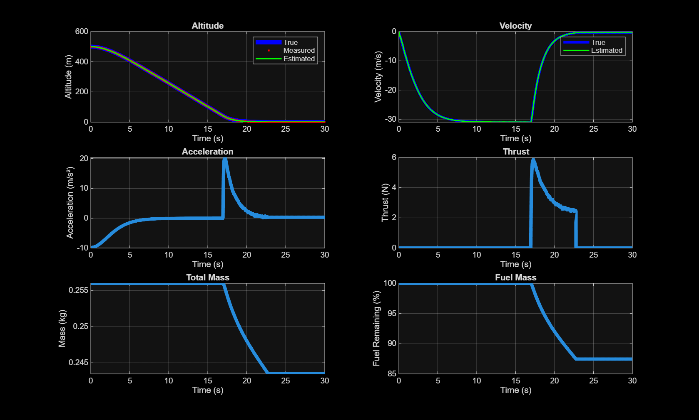
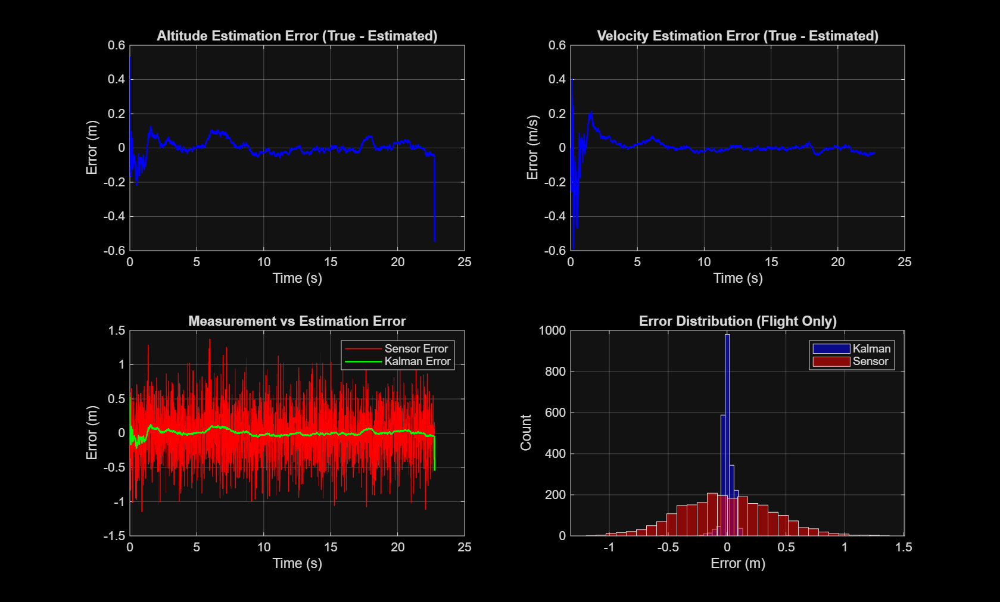

# LQR-Kalman 1D Vertical Landing Simulation

A MATLAB simulation of a rocket performing a controlled vertical landing
using an LQR controller and Kalman filter for state estimation.

## How It Works

True Physics → Noisy Sensors → Kalman Filter → LQR Controller → Thrust Command
                                    ↑                                  |
                                    └──────────────────────────────────┘

- **LQR Controller**: Computes thrust to bring altitude and velocity to zero
- **Kalman Filter**: Estimates altitude and velocity from noisy altimeter
  and accelerometer readings
- **Physics Model**: Simulates gravity, drag, thrust, and fuel consumption

## Requirements

- MATLAB R2018b or later
- Control System Toolbox

## Getting Started

1. Place both files in the same directory
2. Run in MATLAB:
   RunSimulation
3. A dialog box will appear with default values - adjust if needed and click OK
4. Two figures will be generated

## Files

| File | Description |
|---|---|
| RunSimulation.m | Launcher script (GUI, plotting) |
| LQR_Kal_1D_Sim.m | Core simulation function |

## Default Parameters

| Parameter | Default | Unit |
|---|---|---|
| Dry Mass | 0.156 | kg |
| Fuel Mass | 0.1 | kg |
| Gravity | 9.81 | m/s² |
| Initial Altitude | 500 | m |
| Initial Velocity | 0 | m/s |
| Max Time | 30 | s |
| Max Thrust | 100 | N |
| Max Altitude Error | 40 | m |
| Max Velocity Error | 30 | m/s |
| Time Step | 0.01 | s |
| Drag Coefficient | 0.45 | - |
| Air Density | 1.225 | kg/m³ |
| Altimeter Noise (σ) | 0.4 | m |
| Accelerometer Noise (σ) | 0.15 | m/s² |
| Model Uncertainty | 2.0 | - |

## Plots

### Figure 1: Simulation Results
- Altitude (true vs measured vs estimated)
- Velocity (true vs estimated)
- Acceleration, Thrust, Mass, Fuel

### Figure 2: Kalman Filter Performance
- Altitude and velocity estimation errors
- Sensor error vs Kalman error comparison
- Error distribution histogram

## Quick Tuning Guide

| Goal | What to Change |
|---|---|
| Faster response | Decrease max_alt_error or max_velo_error |
| Less aggressive thrust | Increase max_alt_error or max_velo_error |
| Smoother estimates | Decrease model_uncertainty |
| More responsive estimates | Increase model_uncertainty |
| Simulate better sensors | Decrease sigma_alt and sigma_acc |
| Simulate worse sensors | Increase sigma_alt and sigma_acc |

## Limitations

- 1D only (no lateral dynamics or attitude control)
- Constant air density (no atmospheric variation with altitude)
- Linear Kalman filter (drag is nonlinear)
- No sensor delay or bias modeling
